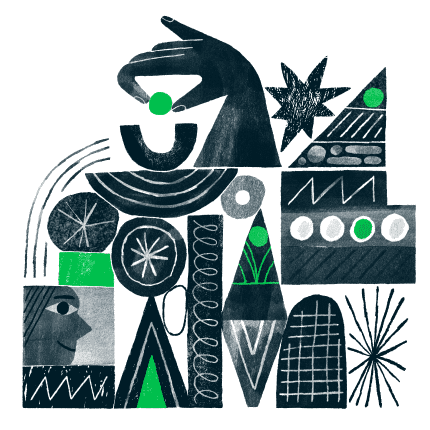

  <section class="mc-home-hero">
    

      

        

          <h1 class="mc-home-hero-title">Build with Mailchimp</h1>
          
Mailchimp’s developer tools provide everything you need to integrate your data with intelligent marketing tools and event-driven transactional email and SMS.

        

        

      

    

  </section>

  <section class="mc-home-products">
    

      

      

        
Mailchimp Marketing API

        <a class="mc-home-product-title" href="/marketing">Send marketing campaigns</a>
        <ul class="mc-home-plinks">
          <li><a class="mc-home-plink" href="/marketing/guides/quick-start">Quick Start</a></li>
          <li><a class="mc-home-plink" href="/marketing/api">API Reference</a></li>
          <li><a class="mc-home-plink" href="/marketing/docs/fundamentals">Documentation</a></li>
        </ul>
        
Mailchimp’s Marketing API powers timely, relevant marketing campaigns with custom data pulled directly from your app.        

      

      

        
Mailchimp Transactional

        <a class="mc-home-product-title" href="/transactional">Send transactional email and SMS</a>
        <ul class="mc-home-plinks">
          <li><a class="mc-home-plink" href="/transactional/guides/quick-start">Quick Start</a></li>
          <li><a class="mc-home-plink" href="/transactional/api">API Reference</a></li>
          <li><a class="mc-home-plink" href="/transactional/docs/fundamentals">Documentation</a></li>
        </ul>
        
Mailchimp Transactional (formerly Mandrill) sends targeted and event-driven messages via the API or SMTP, fast—with best-in-class deliverability.

      

      

    

  </section>

  <section class="mc-home-stats">
    

      <h2 class="mc-home-stats-title">You’ll be in good company</h2>
      
When you build integrations with Mailchimp, you’re creating tools for a trusted and reliable platform that powers marketing, e-commerce, and more for millions of small businesses.

      

        

          
14M

          
Trusted by fourteen million customers and counting

        

        

          
1B

          
Rock-solid reliability delivers 1 billion emails daily

        

        

          
300+

          
Dev teams have launched over 300 Mailchimp integrations so far

        

      

    

  </section>

  <section class="mc-home-promo mc-home-promo--light">
    

      

        

          
Mailchimp Integration Partner Program

          <h2 class="mc-home-promo-title">A helping hand to scale your Mailchimp Integration</h2>
          
As an Integration Partner, you’ll have access to exclusive benefits, insights, and opportunities to grow your business.

          <a class="mc-home-promo-btn" href="/integration-partner-program">Learn more</a>
        

        

      

    

  </section>

  <section class="mc-home-promo mc-home-promo--dark">
    

      <h2 class="mc-home-promo-title">$1 Million to the Developer Community</h2>
      
We’ve invested in the developer community with a fund to power the creation of new Mailchimp integrations. Keep an eye on the integrations directory to see what’s new!

      <a class="mc-home-promo-link" href="https://mailchimp.com/integrations/">Browse Integrations</a>
    

  </section>

  <section class="mc-home-quote">
    

      

        <button class="mc-quote-arrow mc-quote-prev" aria-label="Previous testimonial"><svg viewBox="0 0 24 24" width="22" height="22" fill="none" stroke="currentColor" stroke-width="2" stroke-linecap="round" stroke-linejoin="round"><path d="M15 18l-6-6 6-6"/></svg></button>
        

          <figure class="mc-quote-slide is-active" data-idx="0">
            <blockquote class="mc-quote-text">On the Mailchimp side, the fact that the API allows us to send automated emails to catch potential customers that might otherwise be lost is a great feature.</blockquote>
            <figcaption class="mc-quote-author">Santiago Paragarino, Senior Magento developer &amp; Gonzalo Dominguez, Senior Engineer, Ebizmarts</figcaption>
          </figure>
          <figure class="mc-quote-slide" data-idx="1">
            <blockquote class="mc-quote-text">Developing the integration using the Mailchimp API 3.0 was a good experience, documentation is easy to understand and very detailed with proper examples of all requests/responses.</blockquote>
            <figcaption class="mc-quote-author">Danilo Alvarenga, CTO, 3dcart</figcaption>
          </figure>
          <figure class="mc-quote-slide" data-idx="2">
            <blockquote class="mc-quote-text">We use the Mailchimp API to simplify our onboarding. We were able to cut down our onboarding by 80% because now a user can just sign in and start listening to music and then we can relate back the music you listen to to your profile.</blockquote>
            <figcaption class="mc-quote-author">Patrick Hill, Executive Director, Disctopia</figcaption>
          </figure>
        

        <button class="mc-quote-arrow mc-quote-next" aria-label="Next testimonial"><svg viewBox="0 0 24 24" width="22" height="22" fill="none" stroke="currentColor" stroke-width="2" stroke-linecap="round" stroke-linejoin="round"><path d="M9 18l6-6-6-6"/></svg></button>
      

      

        <button class="mc-quote-dot is-active" data-idx="0" aria-label="Go to slide 1"></button>
        <button class="mc-quote-dot" data-idx="1" aria-label="Go to slide 2"></button>
        <button class="mc-quote-dot" data-idx="2" aria-label="Go to slide 3"></button>
      

    

  </section>

